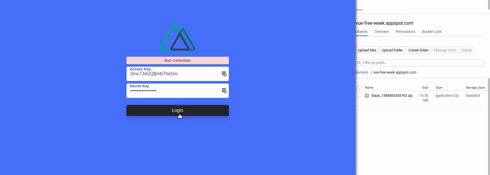

# fireblaze

> My ~~top-notch~~ Nuxt.js project

## Screenshots and Demo Video

[](https://coffeekitkat.keybase.pub/static/fireblaze-demo-video.mp4)

## Build Setup

```bash
# install dependencies
$ yarn install

# serve with hot reload at localhost:3000
$ yarn dev

# build for production and launch server
$ yarn build
$ yarn start
```

Create a `.env` file. Example `.env` file:

```
BASE_URL=http://localhost:3000

# This is your starting admin login credential
APP_ACCESS_KEY=fireblaze
APP_SECRET_KEY=fireblaze123

# enable this to login using `demo` as username and `demo` as password
FIREBLAZE_TEST_DEV=1

# Should we print some console.logs ?
APP_DEBUG=true

ENABLE_ZIP=
ENABLE_FIREBASE=

# This is where we save the zip files
# Please manually create a subfolder name `artifact`
# Absolute path
ARTIFACTS_PATH=

## Firebase Admin
## path to your firebase-app-admin-sdk.json
GOOGLE_APPLICATION_CREDENTIALS=
```